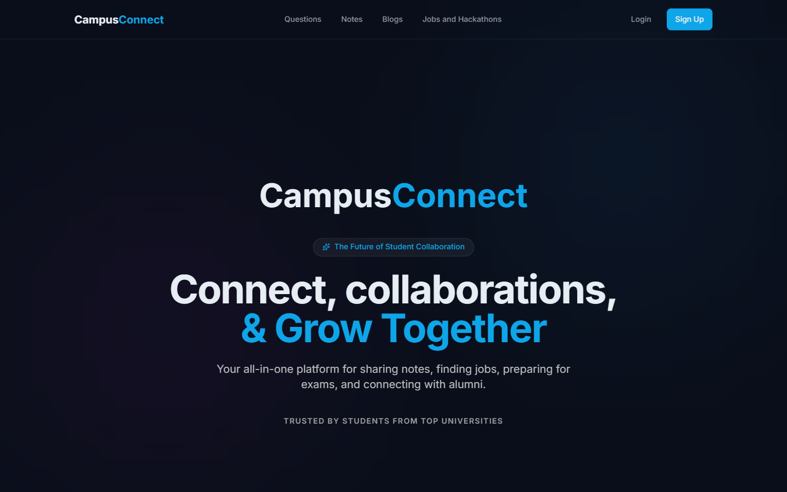
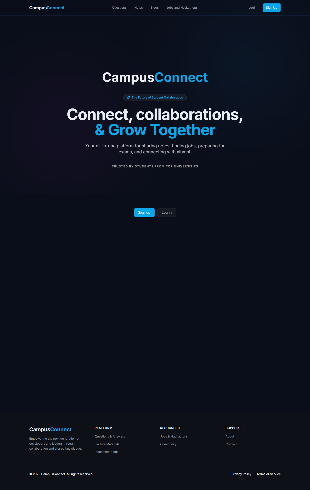
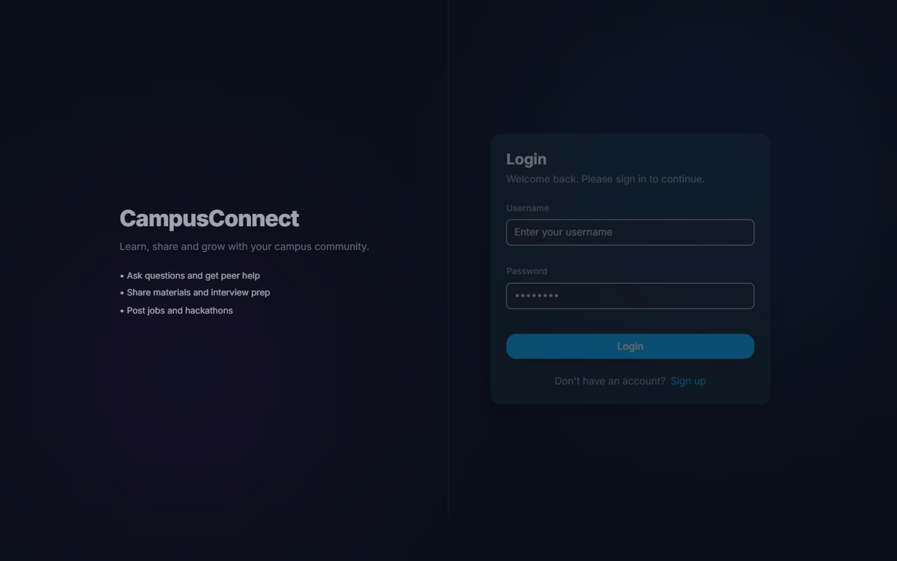
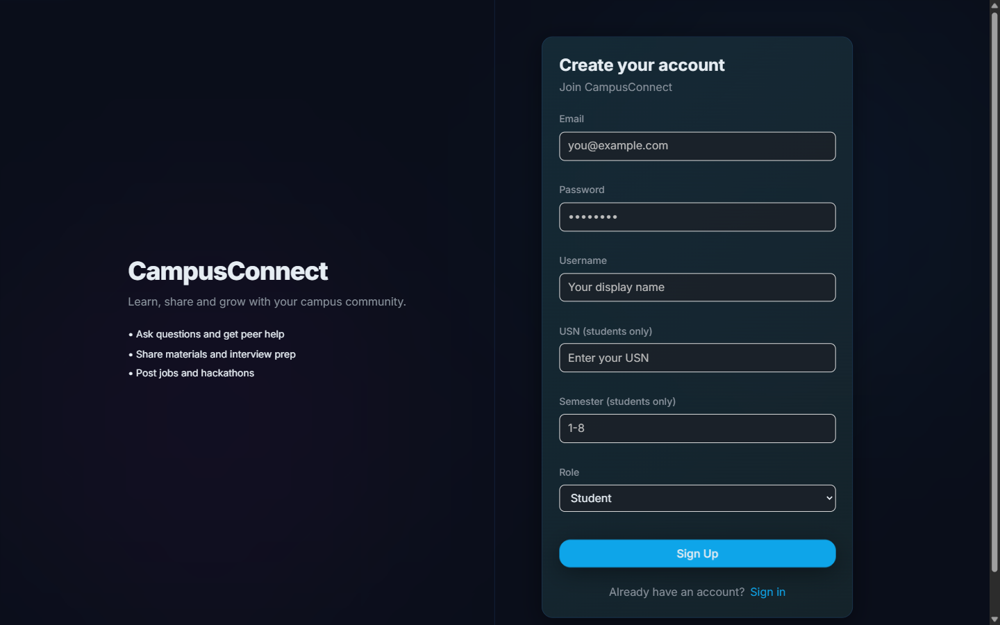
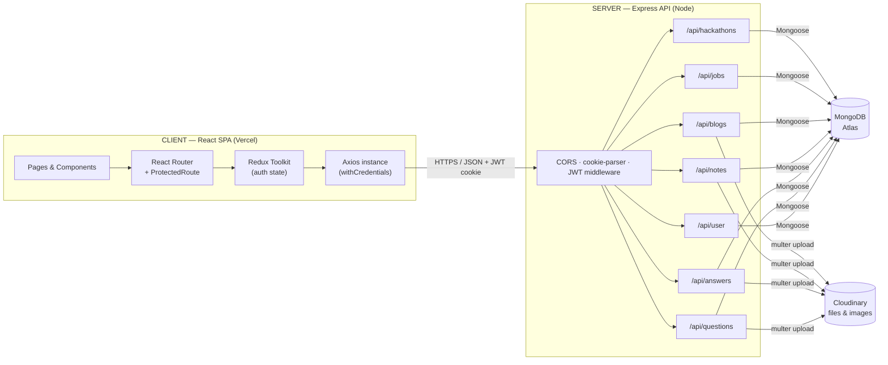
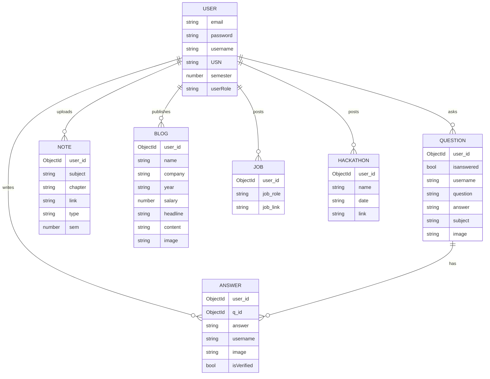

<div align="center">


# Campus Connect

### Linking students, alumni, and industry — one campus community.

An all-in-one platform where students share notes, ask & answer questions, read placement blogs from alumni, and discover jobs and hackathons.

[](https://react.dev/)
[](https://vitejs.dev/)
[](https://expressjs.com/)
[](https://www.mongodb.com/)
[](https://tailwindcss.com/)
[](https://redux-toolkit.js.org/)

**[Live Demo →](https://campus-connect-drab-two.vercel.app)**



</div>

---

## Table of contents

- [Overview](#overview)
- [Features](#features)
- [Screenshots](#screenshots)
- [Tech stack](#tech-stack)
- [Architecture](#architecture)
- [Data model](#data-model)
- [API reference](#api-reference)
- [Getting started](#getting-started)
- [Project structure](#project-structure)
- [Deployment](#deployment)
- [Roadmap](#roadmap)
- [Contributing](#contributing)

## Overview

Campus Connect is a **MERN** (MongoDB · Express · React · Node) web app built to bring a
college community together in a single place. It is organised around three roles —
**students**, **teachers**, and **alumni** — each with tailored capabilities:

- **Students & teachers** collaborate through a Q&A board and a shared library of lecture notes.
- **Alumni** publish placement blogs to guide juniors through interviews and career choices.
- **Everyone** can post and browse jobs and hackathons.

Access is gated by JSON Web Tokens and role-based route protection on both the client and the server.

## Features

| Module | What it does | Who can post |
| --- | --- | --- |
| ❓ **Q&A** | Ask questions (with an optional image), post answers, edit your own, and mark answers as verified | Students, Teachers |
| 📚 **Notes** | Upload lecture notes and materials by subject, chapter, semester, and type; browse and download | Students, Teachers |
| ✍️ **Blogs** | Write placement / experience blogs with company, role, package, and cover image | Alumni |
| 💼 **Jobs** | Share job openings with a role and application link | All authenticated roles |
| 🏆 **Hackathons** | Post hackathons with name, date, and registration link | All authenticated roles |
| 🔐 **Auth** | Signup / login / logout with hashed passwords (bcrypt) and JWT sessions | — |

Additional touches:

- **Role-based access control** — routes are guarded client-side (`ProtectedRoute`) and validated server-side.
- **Cloudinary uploads** — images and files are stored on Cloudinary via `multer`.
- **Polished UI** — dark theme, animated page transitions (Framer Motion + GSAP), reusable UI primitives, and toast notifications.

## Screenshots

| Home | Login |
| --- | --- |
|  |  |

| Sign up (role-aware form) |
| --- |
|  |

## Tech stack

**Frontend**
- React 18 + Vite 5
- React Router 6, Redux Toolkit + React-Redux
- Tailwind CSS, Material Tailwind, MUI, styled-components / Emotion
- Framer Motion, GSAP, React Transition Group (animations)
- Axios (API client), React Toastify (notifications), Lucide / Heroicons (icons)

**Backend**
- Node.js + Express 4
- MongoDB + Mongoose 8
- JSON Web Tokens (`jsonwebtoken`) + bcryptjs for auth
- Multer + Cloudinary for file/image uploads
- cookie-parser, cors, dotenv

**Deployment**
- Frontend on Vercel · Backend on a Node host · MongoDB Atlas

## Architecture



## Data model



## API reference

Base URL: `http://localhost:8080` (development). All routes are prefixed with `/api`.

### Auth — `/api/user`
| Method | Endpoint | Description |
| --- | --- | --- |
| `POST` | `/signup` | Create an account (role-aware) |
| `POST` | `/login` | Log in, returns a JWT cookie |
| `GET`  | `/logout` | Clear the session |

### Questions — `/api/questions`
| Method | Endpoint | Description |
| --- | --- | --- |
| `GET`    | `/viewQns` | List all questions |
| `GET`    | `/getQn/:id` | Get one question |
| `POST`   | `/postQn` | Create a question |
| `PUT`    | `/update/:id` | Edit a question |
| `DELETE` | `/delete/:id` | Delete a question |

### Answers — `/api/answers`
| Method | Endpoint | Description |
| --- | --- | --- |
| `POST`   | `/new` | Post an answer |
| `GET`    | `/getAns/:id` | Get answers for a question |
| `PUT`    | `/update/:qid` | Edit an answer |
| `POST`   | `/isVerified/:id` | Mark an answer verified |
| `DELETE` | `/delete/:id` | Delete an answer |

### Notes — `/api/notes`
| Method | Endpoint | Description |
| --- | --- | --- |
| `POST`   | `/uploadNotes` | Upload notes (file via Cloudinary) |
| `GET`    | `/getNotes` | List notes |
| `GET`    | `/getNote/:id` | Get one note |
| `PUT`    | `/update/:id` | Edit a note |
| `DELETE` | `/delete/:id` | Delete a note |

### Blogs — `/api/blogs`
| Method | Endpoint | Description |
| --- | --- | --- |
| `GET`    | `/viewBlogs` | List blogs |
| `GET`    | `/getBlog/:id` | Get one blog |
| `POST`   | `/newBlog` | Publish a blog |
| `PUT`    | `/update/:id` | Edit a blog |
| `DELETE` | `/delete/:id` | Delete a blog |

### Jobs — `/api/jobs`
| Method | Endpoint | Description |
| --- | --- | --- |
| `GET`    | `/getJobs` | List jobs |
| `GET`    | `/getJob/:id` | Get one job |
| `POST`   | `/new` | Post a job |
| `PUT`    | `/update/:id` | Edit a job |
| `DELETE` | `/delete/:id` | Delete a job |

### Hackathons — `/api/hackathons`
| Method | Endpoint | Description |
| --- | --- | --- |
| `GET`    | `/getHackathons` | List hackathons |
| `GET`    | `/getHackathon/:id` | Get one hackathon |
| `POST`   | `/addHackathon` | Post a hackathon |
| `PUT`    | `/update/:id` | Edit a hackathon |
| `DELETE` | `/delete/:id` | Delete a hackathon |

## Getting started

### Prerequisites
- **Node.js** 18+ and npm
- A **MongoDB** connection string (local or MongoDB Atlas)
- A **Cloudinary** account (for file/image uploads)

### 1. Clone
```bash
git clone https://github.com/mathacharan30/campus-connect.git
cd campus-connect
```

### 2. Backend (`SERVER`)
```bash
cd SERVER
npm install
```
Create a `.env` file in `SERVER/`:
```env
MongoDB_URL=your_mongodb_connection_string
CLOUDINARY_CLOUD_NAME=your_cloud_name
CLOUDINARY_API_KEY=your_api_key
CLOUDINARY_API_SECRET=your_api_secret
```
Run it:
```bash
npx nodemon app.js   # or: node app.js
# API on http://localhost:8080
```

### 3. Frontend (`CLIENT`)
```bash
cd ../CLIENT
npm install
npm run dev
# App on http://localhost:5173
```

> The backend enables CORS for `http://localhost:5173` and the production Vercel URL out of the box.

## Project structure

```
campus-connect/
├── CLIENT/                  # React + Vite single-page app
│   └── src/
│       ├── pages/           # Route views (Home, Login, QNA, Blogs, Jobs …)
│       ├── components/      # UI components (Navbar, Footer, ui/, UiOverhaul/)
│       ├── slices/          # Redux Toolkit slices (auth, notifications)
│       ├── ProtectedRoute.jsx
│       ├── axios.jsx        # Configured Axios instance
│       └── App.jsx          # Routes + layout
└── SERVER/                  # Express REST API
    ├── models/              # Mongoose schemas (user, question, answer, note, blog, job, hackathon)
    ├── routes/              # Route handlers per resource
    ├── utils/cloudinary.js  # Cloudinary config
    ├── middlewares.js       # Auth / role middleware
    └── app.js               # Server entry point
```

## Deployment

- **Frontend** deploys to **Vercel** (`CLIENT/vercel.json` handles SPA rewrites). Set the production API base URL for the Axios instance.
- **Backend** runs on any Node host (Render, Railway, etc.). Provide the environment variables above and add the deployed frontend origin to the CORS allow-list in `SERVER/app.js`.
- **Database** on MongoDB Atlas.

## Roadmap

- [ ] Move the JWT secret to an environment variable
- [ ] Search & filtering across notes, jobs, and questions
- [ ] Notifications and activity feed
- [ ] Rich-text editor for blogs
- [ ] Unit / integration tests and CI

## Contributing

Contributions are welcome! Fork the repo, create a feature branch, and open a pull request.
For larger changes, please open an issue first to discuss what you'd like to change.

---

<div align="center">
Built with the MERN stack · <a href="https://campus-connect-drab-two.vercel.app">Live Demo</a>
</div>
